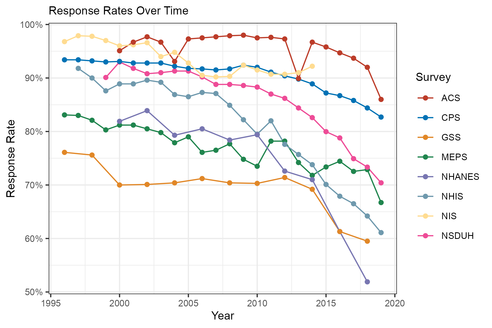

# Survey Response Rates

## Introduction

The following document compiles trends in response rates to household surveys over the years. This dataset focuses on seven nationally representative surveys that are sponsored by various departments within the U.S. government. These surveys have been chosen based on the availability of consistent trend data for response rates. The surveys span a range of health, social, and economic topics and are conducted by respected institutions.

The eight surveys included in this analysis are:

- [The National Health Interview Survey (NHIS)](https://www.cdc.gov/nchs/nhis/index.htm), sponsored by the National Center for Health Statistics (NCHS) within the Centers for Disease Control and Prevention (CDC)  
- [The National Health and Nutrition Examination Survey (NHANES)](https://www.cdc.gov/nchs/nhanes/index.htm), also sponsored by NCHS  
- [The National Immunization Survey (NIS)](https://www.cdc.gov/nis/about/?CDC_AAref_Val=https://www.cdc.gov/vaccines/imz-managers/nis/index.html), sponsored by the National Center for Immunization and Respiratory Diseases within CDC  
- [The National Survey of Drug Use and Health (NSDUH)](https://nsduhweb.rti.org/respweb/homepage.cfm), sponsored by the Substance Abuse and Mental Health Services Administration (SAMHSA)  
- [The Medical Expenditure Panel Survey (MEPS)](https://www.meps.ahrq.gov/mepsweb/), sponsored by the Agency for Healthcare Research and Quality (AHRQ)  
- [The Current Population Survey (CPS)](https://www.census.gov/programs-surveys/cps.html), co-sponsored by the Bureau of Labor Statistics (BLS) and the U.S. Census Bureau, which performs the data collection  
- [The General Social Survey (GSS)](https://gss.norc.org/), sponsored by the National Opinion Research Center (NORC) at the University of Chicago  
- [The American Community Survey (ACS)](https://www.census.gov/programs-surveys/acs), conducted by the U.S. Census Bureau, a survey in which responding is federally required for selected households.

## Data Notes

**Notes on Response Rate Columns Used for the Plot:**

- For NHIS, the response rate used is from the **household module**.

- For NHANES, the response rate is based on the **personal interview**, conditional on selection into the sample following the completion of the household screening interview.

- For NIS, the response rate is from the **household interview**, conditional on having an age-eligible child as determined from a screening interview, specifically for the landline telephone sample.

- For NSDUH, the response rate comes from the **household screening interview**.

- For MEPS, the response rate is from the **initial interview**, conditional on completion of the prior year's NHIS household interview. The formula for this is `conditional = unconditional / NHIS prior year`.

- For CPS, the response rate is from the **March labor force interview**, indicated by `Period == 'M03'`.

- For GSS, the response rate used is the **overall response rate**.

- For ACS, the response rate used is the **overall response rate**.

## Data Sources
- NHIS: https://ftp.cdc.gov/pub/Health_Statistics/NCHS/Dataset_Documentation/NHIS/2023/srvydesc-508.pdf

- NHANES: https://wwwn.cdc.gov/nchs/nhanes/responserates.aspx

- NIS: https://ftp.cdc.gov/pub/Health_Statistics/NCHS/Dataset_Documentation/NIS/NISPUF14_DUG.PDF

- NSDUH: https://www.samhsa.gov/data/report/nsduh-2024-methodological-resource-book-mrb

- MEPS: https://meps.ahrq.gov/mepsweb/survey_comp/hc_response_rate.jsp

- CPS: https://data.bls.gov/timeseries/LNU09300000&from_year=1994&output_type=column

- GSS: https://gss.norc.org/content/dam/gss/get-documentation/pdf/codebook/GSS_Codebook_AppendixA.pdf

- ACS: https://www.census.gov/acs/www/methodology/sample-size-and-data-quality/response-rates/

